<p align="center">
  
</p>

사용자와 현업의 문제를 **데이터 파이프라인과 평가 가능한 AI 시스템**으로 연결합니다.
모델 성능만 보고 끝내지 않고, 입력 데이터·실패 원인·운영 조건을 분석해 실제로 사용할 수 있는 형태까지 구현합니다.

`Applied AI` 모델·LLM을 API/자동화 파이프라인으로 연결 · `Evaluation` 정확도 외 Recall·비용·실패 사례 검토 · `Reliable Engineering` 재현 가능한 실험과 CI/CD 지향

---

## 매의 눈 — AI 기반 잠재 매장 발굴 시스템

> 텐핑거스(데이트팝) AI 개발 인턴십 · End-to-End Applied AI · 코드/데이터 비공개

영업 담당자가 수작업으로 신규 매장을 찾고 평가하던 과정을, 데이터 수집 → ML/LLM 분류 → QC Score → API 호출이 이어지는 파이프라인으로 전환했습니다. 기획부터 배포까지 개발 전 과정을 단독 수행했습니다.

```
Selenium 멀티소스 수집 → XGBoost 인기도 예측 → SBERT 후보 표현 → Gemini 의미 분류 (QC Score 반영) → FastAPI → Docker/S3
```

**핵심 판단** 기존 제휴 매장과의 유사도만으로는 신규 후보를 발굴하기 어렵다는 한계를 확인하고, 인기도 예측·제휴 가능성·LLM 카테고리 분류를 서로 다른 모델로 분리했습니다.
**공개 범위** 회사 코드와 원천 데이터는 공개하지 않으며, 설계·역할·검증 범위만 정리했습니다 → **[Case Study](case-studies/eagle-eye.md)**

<br>

## Other Work

<table>
<tr><td width="120" valign="top"><br><b>Vision</b></td><td>

**[Capstone Pose — 실시간 낙상 감지](https://github.com/gidaseul/capstone_pose)** · Computer Vision · Team Lead
YOLO로 사람 영역을 제한하고 MediaPipe 33개 관절 좌표를 LSTM 시퀀스 모델에 연결한 2단계 낙상 감지 프로토타입. `(150,99)` 키포인트 시퀀스, 임계값 `0.7`. 전체 테스트셋 Precision/Recall은 아직 미측정이라 성능으로 주장하지 않습니다.


</td></tr>
<tr><td width="120" valign="top"><br><b>ML 실험</b></td><td>

**[Visual Representation Analysis](https://github.com/gidaseul/machine-learning-project)** · Classical ML · Failure Analysis
MNIST·SportsBall 데이터로 ROI/HOG/XGBoost 기반 분류와 Autoencoder/Contrastive 표현학습을 비교. MNIST `98.0%` 대비 SportsBall base CNN `48.0%`으로, 낮은 성능도 latent space·t-SNE로 원인을 분석해 그대로 공개했습니다.

</td></tr>
<tr><td width="120" valign="top"><br><b>의료 AI</b></td><td>

**[Brain MRI Research](https://github.com/gidaseul/brain-mri-research)** · 3D CNN · CAM Interpretation · 학부연구생
3D MRI 볼륨을 `ResNet3D-18`로 학습하고 CAM으로 실제 주목 영역을 시각화. 팀 baseline과 개인 기여를 분리해 표기합니다.

</td></tr>
<tr><td width="120" valign="top"><br><b>제조 AI</b></td><td>

**후판 Scale 불량 예측** · POSCO 청년 AI·Big Data 아카데미 · 5인 팀 모델링 담당
불가능한 센서값과 HSB 조건의 완전분리를 발견해 공정 규칙·통계·예측 모델을 분리. 팀 XGBoost 후보 `Precision 100%` · `Recall 95.88%` · `ROC-AUC 0.9883` (교육용 데이터, 실운영 성과 아님).
원천 데이터는 POSCO 아카데미 실습 자료라 공개하지 않으며, 수행 내용만 정리했습니다 → **[Case Study](case-studies/posco-steel-quality.md)**

</td></tr>
<tr><td width="120" valign="top"><br><b>제조 AI</b></td><td>

**[AppleCare+ — 사과원 병해 진단 대시보드](https://github.com/gidaseul/applecare-orchard)** · CV · VLM · RAG · 팀 프로젝트
드론 촬영 이미지를 분류 → DINO → Grad-CAM → VLM → RAG로 이어 구역→나무→잎 단위 병해 리포트를 생성하는 웹 대시보드. 화면과 모델을 계약(JSON 스펙)으로 분리해, 실제 추론 서버 연동 시 화면 코드는 건드리지 않도록 설계했습니다. 현재는 목업 데이터 단계입니다.

</td></tr>
<tr><td width="120" valign="top"><br><b>팀 프로젝트</b></td><td>

**[Babbogi — 섭취 기반 영양소 관리 앱](https://github.com/gidaseul/babbogi)** · 2024 소프트웨어공모전 은상
4인 팀에서 백엔드/서버 연동을 담당 → **[Case Study](case-studies/babbogi.md)**

</td></tr>
</table>

<br>

## Prototypes

**[Docent AI](https://github.com/gidaseul/tts)** — 관람객 수준별 RAG·LLM·TTS 도슨트. 검색 평가와 테스트를 보강 중입니다.


**[Algorithm Solutions](https://github.com/gidaseul/Algorithm-Solutions)** — 여러 알고리즘 플랫폼의 풀이/통계를 GitHub Actions로 자동 집계.

<details>
<summary>Platform progress</summary>
<br>
<p align="center">
  <br><br>
  <br><br>
  <br><br>
  <br><br>
  
</p>
</details>

<br>

## Experience & Education

- **텐핑거스(데이트팝)** AI 개발 인턴 — 잠재 매장 수집·평가 파이프라인
- **VML Lab** 학부연구생 — Computer Vision 기반 의료 AI 연구
- **Curiator Studio** 팀장·AI 파트 — 다국어 LLM·TTS 도슨트 파이프라인
- **Syncorbis** Bio & Software Engineer — 생명과학 실험 자동화 기획
- 숭실대학교 AI소프트웨어학부 (인공지능·빅데이터융합) · LG Aimers 7기 · SSAFY 15기 · SQLD
- 2019 대한민국 인재상 · 2024 Soongsil Programming Contest 은상 · 2024 소프트웨어공모전 은상

## Engineering Principles

1. 팀 결과와 개인 기여를 분리해 기록합니다.
2. 재현 방법이나 근거가 없는 수치는 성과로 사용하지 않습니다.
3. 성공한 실험뿐 아니라 실패 원인과 한계도 공개합니다.
4. 민감한 원천 데이터·회사 코드·환자 정보는 공개하지 않습니다.

---

<sub>Python · PyTorch · TensorFlow · scikit-learn · FastAPI · Docker · AWS · Java · C/C++</sub>

**Contact** · [GitHub](https://github.com/gidaseul) · [rlektmf0328@gmail.com](mailto:rlektmf0328@gmail.com)
